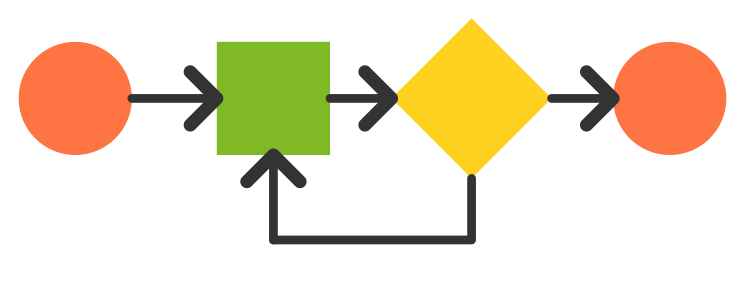

# Bienvenidos!

## Objetivo

El objetivo de este sitio es brindar una experiencia mas flexible y agradable a los estudiantes en las clases prácticas de la cátedra Algoritmos y Estructura de Datos.

Aquí se podrá encontrar el mismo contenido que en la Guía de Trabajos Prácticos impresa publicada por la cátedra, por lo tanto el uso del sitio no es obligatorio y pueden obtener la Guía impresa [aquí](/extra/files/guia.pdf)
